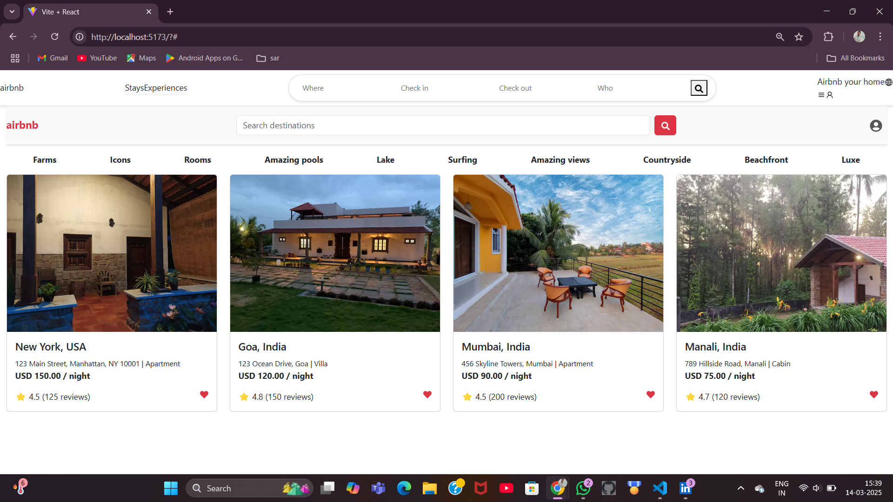

# 🏡 Airbnb Clone

This project is a **full-stack clone** of the Airbnb listing page, where users can view listings with details like location, price, and ratings. The application is built using **React.js** for the frontend and **Django REST Framework (DRF)** for the backend, with data stored in **MySQL**.

---

## ✨ Features

### 🔹 Frontend (React.js + Bootstrap)
- **Airbnb-styled home page**
- **Category-based filters**
- **Fetching real listings via API**
- **Search bar for destinations**
- **User authentication integration (future feature)**

### 🔹 Backend (Django REST Framework)
- **GET API** to fetch Airbnb listings from the database
- **POST API** to add new listings
- **Django Admin Panel** for managing listings
- **MySQL database** for structured data storage
- **CORS setup** to allow frontend-backend communication

---

## 🛠️ Technologies Used

### 🔹 Frontend:
- React.js ⚛️
- React Bootstrap 🎨
- Axios (for API calls) 🌐

### 🔹 Backend:
- Django + Django REST Framework 🐍
- MySQL 🗄️
- Django CORS Headers 🌍
- Scrapy (for web scraping, if implemented) 🔍

---

## 🚀 Getting Started

### 🔹 Backend Setup
1. Clone the repository
